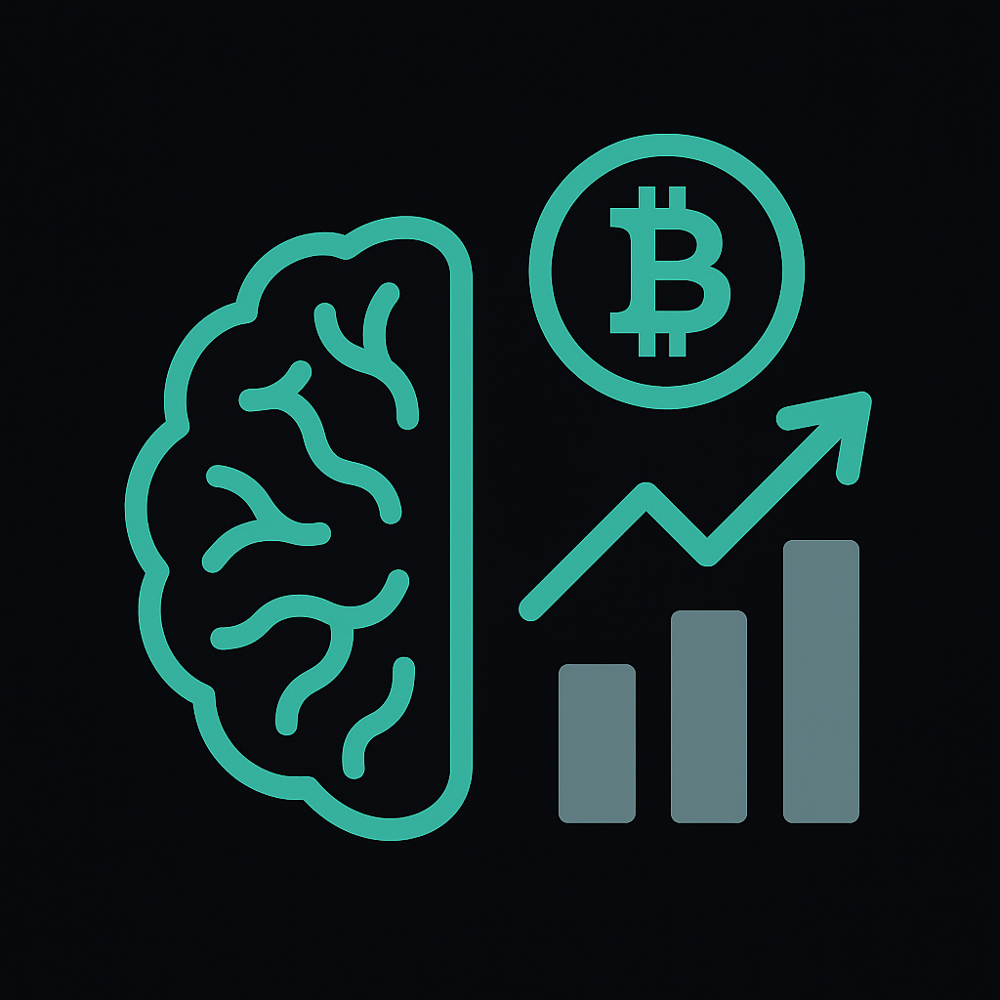
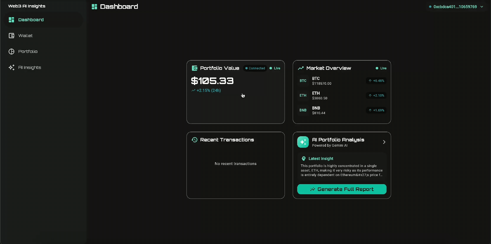
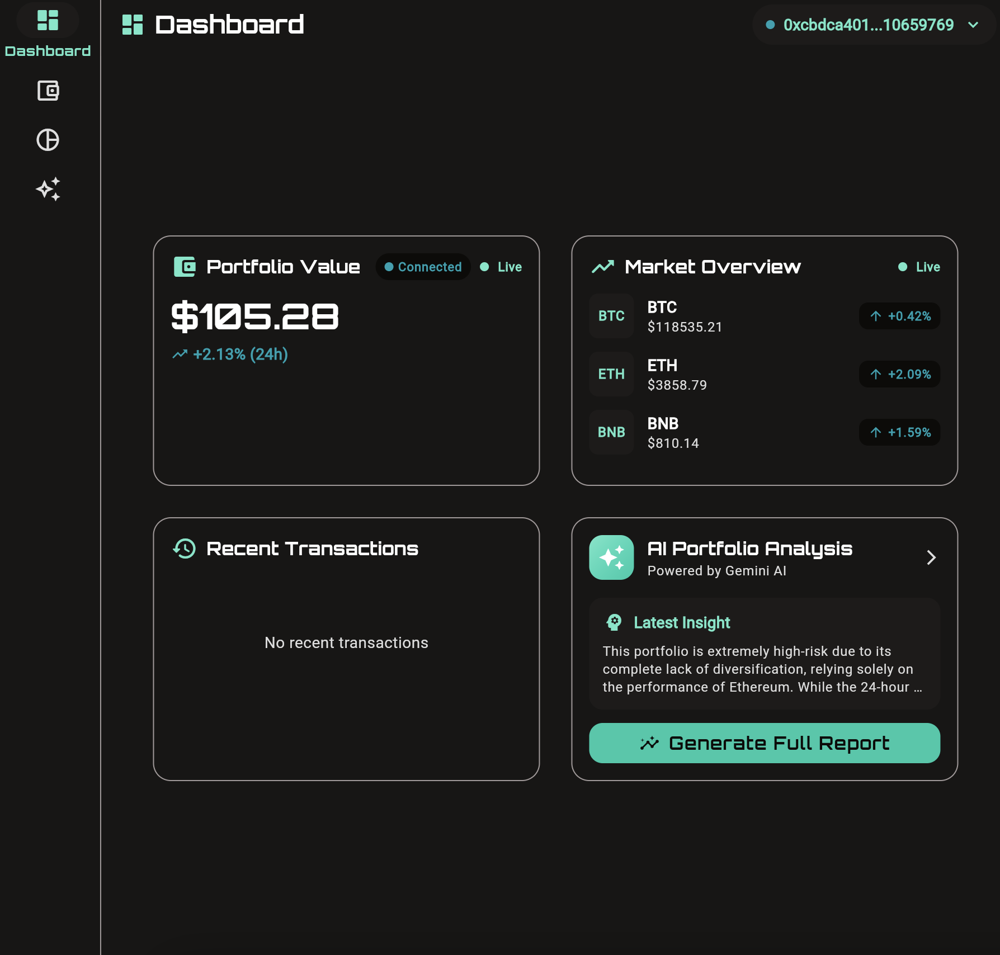
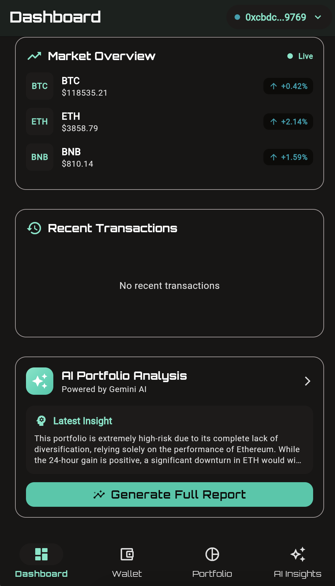

<div align="center">


</div>

## About the project

<div align = "center">

**Web3 AI Insights** is an open-source Flutter Web application that connects to Web3 wallets, fetches token portfolios in real-time, and provides AI-powered analysis using Google Gemini to deliver comprehensive insights, risk assessments, and investment recommendations.
</div>

<div align="center">




**Tablet Laoyout:**



**Mobile Laoyout:**


</div>
---

## Table of Contents

- [Key Features](#key-features)
- [Project Structure](#project-structure)
- [Code Samples](#code-samples)
- [Built With](#built-with)
- [Getting Started](#getting-started)
- [Usage](#usage)
- [Contributing](#contributing)
- [License](#license)

---

## Key Features

- **MetaMask Wallet Integration**: Seamless Web3 wallet connection using JavaScript interop for secure authentication.
- **Real-time Price Streaming**: Uses **Binance WebSocket API** for live price updates with automatic reconnection.
- **AI-Powered Analysis**: Leverages **Google Gemini AI** for intelligent portfolio insights, risk assessment, and investment recommendations.
- **Multi-Chain Support**: Compatible with Ethereum, Polygon, BSC, and other EVM-compatible networks.
- **Responsive Design**: Adaptive layouts that work seamlessly across desktop, tablet, and mobile devices.
- **Token Detection**: Automatically discovers and tracks popular ERC-20 tokens in connected wallets.
- **Transaction History**: Displays recent token transfers and transaction details.
- **Dark Theme**: Modern, eye-friendly dark theme optimized for extended use.
- **Clean Architecture**: Maintainable codebase with clear separation of concerns using repository pattern.
- **Type-Safe State Management**: Robust state handling with **Riverpod** and code generation.

---

## Project Structure

```
flutter_web3_ai_insights/
├── assets/                 # Images and assets
├── lib/
│   ├── core/              # Core functionality
│   │   ├── constants/     # App constants and configurations
│   │   ├── theme/         # Theming and styling
│   │   ├── utils/         # Utilities and helpers
│   │   └── widgets/       # Reusable widgets
│   ├── features/          # Feature modules
│   │   ├── ai_insights/   # AI analysis feature
│   │   ├── dashboard/     # Main dashboard
│   │   ├── portfolio/     # Portfolio management
│   │   └── wallet/        # Wallet connection
│   ├── repositories/      # Business logic layer
│   ├── routes/            # Navigation configuration
│   └── services/          # External service integrations
│       ├── binance_rest/      # REST API integration
│       ├── binance_websocket/ # WebSocket integration
│       ├── gemini/            # AI service
│       └── web3/              # Blockchain interaction
├── web/                   # Web platform files
├── .env                   # Environment variables
├── pubspec.yaml          # Dependencies
└── README.md             # Project documentation
```

### Architecture Layers

#### Presentation Layer
- **Responsibility**: Handles all UI and user interaction logic.
- **Components**:
  - **Screens**: Main application screens (Dashboard, Portfolio, AI Insights, Wallet).
  - **Widgets**: Reusable UI components with responsive layouts.
  - **Providers**: Riverpod providers for state management and dependency injection.

#### Repository Layer
- **Responsibility**: Contains business logic and data aggregation.
- **Components**:
  - **Models**: Business entities (PortfolioToken, WalletState, PortfolioAnalysis).
  - **Repository Interfaces**: Abstract definitions for data operations.
  - **Repository Implementations**: Concrete implementations that coordinate between services.

#### Service Layer
- **Responsibility**: Handles external integrations and platform-specific code.
- **Components**:
  - **Web3Service**: MetaMask integration using JS interop.
  - **BinanceServices**: REST and WebSocket APIs for market data.
  - **GeminiService**: AI integration for portfolio analysis.
  - **StorageService**: Local data persistence.

---

## Code Samples

### 1. Web3 Wallet Connection with JavaScript Interop

This project features a sophisticated MetaMask integration using Dart's JS interop capabilities. The implementation provides type-safe communication between Flutter Web and the browser's Ethereum provider.

```dart
// lib/services/web3/web3_service_impl.dart

// JS interop definitions for type-safe MetaMask communication
@JS('window')
external Window get window;

@JS()
extension type Window(JSObject _) implements JSObject {
  external Ethereum? get ethereum;
}

@JS()
extension type Ethereum(JSObject _) implements JSObject {
  external bool? get isMetaMask;
  external String? get chainId;
  external JSPromise<JSAny?> request(JSObject params);
}

class Web3ServiceImpl implements Web3Service {
  @override
  Future<WalletConnectionStatus> connect() async {
    try {
      _updateStatus(WalletConnectionStatus.connecting());

      // Check if MetaMask is available
      final ethereum = window.ethereum;
      if (ethereum == null || !(ethereum.isMetaMask ?? false)) {
        throw Exception('MetaMask is not installed');
      }

      // Request account access
      final requestParams = {'method': 'eth_requestAccounts'}.jsify()! as JSObject;
      final response = await ethereum.request(requestParams).toDart;

      if (response != null && response.dartify() is List) {
        final accounts = response.dartify()! as List;
        final address = accounts.first.toString();

        // Get additional wallet info
        final balance = await getBalance(address);
        final chainId = await getChainId();

        final walletInfo = WalletInfo(
          address: address,
          balance: balance,
          chainId: chainId,
          networkName: _getNetworkName(chainId),
        );

        final status = WalletConnectionStatus.connected(walletInfo);
        _updateStatus(status);
        return status;
      }
    } catch (e) {
      final errorStatus = WalletConnectionStatus.error(e.toString());
      _updateStatus(errorStatus);
      return errorStatus;
    }
  }

  // Fetch ERC-20 token balances using eth_call
  @override
  Future<List<TokenBalance>> getTokenBalances(String walletAddress) async {
    final ethereum = _getEthereum();
    final tokenBalances = <TokenBalance>[];

    // ERC-20 balanceOf function signature
    const balanceOfSignature = '0x70a08231'; // keccak256("balanceOf(address)")[:8]

    for (final token in commonTokens) {
      try {
        // Encode the address parameter
        final addressParam = walletAddress.replaceFirst('0x', '').padLeft(64, '0');
        final data = '$balanceOfSignature$addressParam';

        final params = [
          {'to': token['contractAddress'], 'data': data}.jsify(),
          'latest'.toJS,
        ].toJS;

        final requestParams = {'method': 'eth_call', 'params': params}.jsify()! as JSObject;
        final result = await ethereum.request(requestParams).toDart;

        if (result != null) {
          final balanceHex = (result as JSString).toDart;
          final balance = BigInt.parse(balanceHex.replaceFirst('0x', ''), radix: 16);

          if (balance > BigInt.zero) {
            tokenBalances.add(TokenBalance(
              symbol: token['symbol'],
              name: token['name'],
              contractAddress: token['contractAddress'],
              balance: balance,
              decimals: token['decimals'],
            ));
          }
        }
      } catch (e) {
        continue; // Skip failed tokens
      }
    }

    return tokenBalances;
  }
}
```

### 2. Adaptive Responsive Layouts

The application features a sophisticated responsive design system that adapts to different screen sizes, providing optimal user experience across all devices.

```dart
// lib/core/widgets/adaptive_scaffold.dart

/// An adaptive scaffold that changes navigation style based on screen size
class AdaptiveScaffold extends ConsumerWidget {
  const AdaptiveScaffold({
    super.key,
    required this.currentRoute,
    required this.body,
    this.title,
    this.actions,
  });

  final String currentRoute;
  final Widget body;
  final String? title;
  final List<Widget>? actions;

  @override
  Widget build(BuildContext context, WidgetRef ref) {
    return LayoutBuilder(
      builder: (context, constraints) {
        if (AppBreakpoints.isMobile(constraints.maxWidth)) {
          return AdaptiveScaffoldMobileLayout(
            currentRoute: currentRoute,
            body: body,
            title: title,
            actions: actions,
          );
        } else if (AppBreakpoints.isTablet(constraints.maxWidth)) {
          return AdaptiveScaffoldTabletLayout(
            currentRoute: currentRoute,
            body: body,
            title: title,
            actions: actions,
          );
        } else {
          return AdaptiveScaffoldDesktopLayout(
            currentRoute: currentRoute,
            body: body,
            title: title,
            actions: actions,
          );
        }
      },
    );
  }
}

// lib/features/portfolio/presentation/widgets/portfolio_summary_card.dart

/// Responsive portfolio summary that adapts its layout
class PortfolioSummaryCard extends ConsumerWidget {
  @override
  Widget build(BuildContext context, WidgetRef ref) {
    return ResponsiveWidget(
      mobile: PortfolioSummaryCardMobile(tokens: tokens),
      tablet: PortfolioSummaryCardTablet(tokens: tokens),
      desktop: PortfolioSummaryCardDesktop(tokens: tokens),
    );
  }
}

// Desktop layout with horizontal stats
class PortfolioSummaryCardDesktop extends StatelessWidget {
  @override
  Widget build(BuildContext context) {
    return Card(
      child: Padding(
        padding: const EdgeInsets.all(AppSpacing.xl),
        child: Row(
          children: [
            Expanded(
              child: Widget()...
            ),
            const VerticalDivider(),
            Widget()...
          ],
        ),
      ),
    );
  }
}
```

### 3. Real-time WebSocket Price Streaming

The application streams live cryptocurrency prices using Binance WebSocket API with automatic reconnection and error handling.

```dart
// lib/services/binance_websocket/binance_websocket_service_impl.dart

class BinanceWebSocketServiceImpl implements BinanceWebSocketService {
  WebSocketChannel? _channel;
  final _tickerController = StreamController<TokenTicker>.broadcast();
  final Set<String> _subscribedSymbols = {};
  Timer? _reconnectTimer;
  Timer? _pingTimer;

  @override
  Stream<TokenTicker> get tickerStream => _tickerController.stream;

  @override
  void subscribeToSymbols(List<String> symbols) {
    final newSymbols = symbols.where((s) => !_subscribedSymbols.contains(s)).toList();
    
    if (newSymbols.isEmpty) return;

    _subscribedSymbols.addAll(newSymbols);
    
    if (_channel == null) {
      _connect();
    } else {
      _subscribeToStreams(newSymbols);
    }
  }

  void _connect() async {
    try {
      final uri = Uri.parse(ApiConstants.binanceWebSocketUrl);
      _channel = WebSocketChannel.connect(uri);

      _channel!.stream.listen(
        _handleMessage,
        onError: _handleError,
        onDone: _handleDisconnection,
      );

      // Subscribe to all symbols after connection
      if (_subscribedSymbols.isNotEmpty) {
        _subscribeToStreams(_subscribedSymbols.toList());
      }

      _startPingTimer();
      _logger.i('WebSocket connected successfully');
    } catch (e) {
      _logger.e('Failed to connect WebSocket: $e');
      _scheduleReconnection();
    }
  }

  void _handleMessage(dynamic message) {
    try {
      final data = jsonDecode(message as String) as Map<String, dynamic>;
      
      // Handle subscription responses
      if (data.containsKey('result') && data['result'] == null) {
        _logger.d('Subscription successful');
        return;
      }

      // Handle ticker updates
      if (data['e'] == '24hrTicker') {
        final ticker = TokenTicker.fromJson(data);
        _tickerController.add(ticker);
        _logger.d('Price update: ${ticker.symbol} = ${ticker.price}');
      }
    } catch (e) {
      _logger.e('Error parsing WebSocket message: $e');
    }
  }

  void _subscribeToStreams(List<String> symbols) {
    if (_channel == null) return;

    final streams = symbols.map((s) => '${s.toLowerCase()}@ticker').toList();
    final request = {
      'method': 'SUBSCRIBE',
      'params': streams,
      'id': DateTime.now().millisecondsSinceEpoch,
    };

    _channel!.sink.add(jsonEncode(request));
    _logger.i('Subscribing to streams: $streams');
  }

  void _scheduleReconnection() {
    _reconnectTimer?.cancel();
    _reconnectTimer = Timer(const Duration(seconds: 5), () {
      _logger.i('Attempting to reconnect WebSocket...');
      _connect();
    });
  }

  @override
  void dispose() {
    _pingTimer?.cancel();
    _reconnectTimer?.cancel();
    _channel?.sink.close();
    _tickerController.close();
    _subscribedSymbols.clear();
  }
}
```

## Built With

- **Framework**: **[Flutter](https://flutter.dev)** (Web-first with mobile support).
- **Language**: **[Dart](https://dart.dev)** 3.7.2+.
- **Architecture**: **Clean Architecture** with Repository Pattern.
- **State Management**: **[Riverpod](https://riverpod.dev)** with code generation.
- **Navigation**: **[Go Router](https://pub.dev/packages/go_router)** for declarative routing.
- **Web3 Integration**: **[web3dart](https://pub.dev/packages/web3dart)** with JS interop.
- **AI Integration**: **[Google Gemini AI](https://deepmind.google/technologies/gemini/)**.
- **Market Data**: **[Binance APIs](https://developers.binance.com/docs/binance-spot-api-docs/web-socket-api)** (REST & WebSocket).
- **HTTP Client**: **[Dio](https://pub.dev/packages/dio)** with caching.
- **REST API Client**: **[Retrofit](https://pub.dev/packages/retrofit)** for type-safe API calls.
- **WebSocket**: **[web_socket_channel](https://pub.dev/packages/web_socket_channel)**.
- **Code Generation**: **[Build Runner](https://pub.dev/packages/build_runner)** with Freezed.
- **Theming**: **Material 3** with custom theme system.
- **Localization**: Built-in internationalization support.

## Getting Started

### Prerequisites

Before running this project, make sure you have:

- **Flutter SDK** (3.7.2 or higher).
- **Dart SDK** (included with Flutter).
- **Chrome** or any modern web browser.
- **MetaMask Extension** installed in your browser.
- **Google Gemini API Key** (get one from [Google AI Studio](https://makersuite.google.com/app/apikey)).

### Installation

1. **Clone the repository**
   ```bash
   git clone https://github.com/TBR-Group-software/flutter_web3_ai_insights.git
   cd flutter_web3_ai_insights
   ```

2. **Install dependencies**
   ```bash
   flutter pub get
   ```

3. **Set up environment variables**
   
   Create a `.env` file in the root directory:
   ```env
   GEMINI_API_KEY=your_google_gemini_api_key_here
   GEMINI_MODEL=gemini-2.0-flash-exp
   ```

4. **Generate code (for Riverpod providers and JSON serialization)**
   ```bash
   dart run build_runner build --delete-conflicting-outputs
   ```

5. **Run the application**
   ```bash
   flutter run -d chrome
   ```

### Development Commands

```bash
# Run with web renderer options
flutter run -d chrome --web-renderer html  # For better text rendering
flutter run -d chrome --web-renderer canvaskit  # For better performance

# Build for production
flutter build web --release

# Generate code
dart run build_runner watch  # Watch mode for development

# Clean and rebuild
flutter clean
flutter pub get
dart run build_runner build --delete-conflicting-outputs
```

## Usage

1. **Connect Wallet**: Click "Connect Wallet" and approve the MetaMask connection.
2. **View Portfolio**: Your token balances will automatically load with real-time prices.
3. **Generate AI Analysis**: Click "Generate AI Report" to get insights about your portfolio.
4. **Real-time Updates**: Watch your portfolio value update in real-time as prices change.
5. **Responsive Experience**: Try resizing your browser to see the adaptive layout.
6. **Multi-Chain**: Switch networks in MetaMask to view tokens on different chains.

### Features Overview

- **Dashboard**: Overview of your portfolio with key metrics.
- **Portfolio**: Detailed view of all tokens with individual performance.
- **AI Insights**: Comprehensive analysis with risk assessment and recommendations.
- **Wallet**: Connection status and network information.

## Contributing

1. Fork the project
2. Create your feature branch (`git checkout -b feature/AmazingFeature`)
3. Commit your changes (`git commit -m 'Add some AmazingFeature'`)
4. Push to the branch (`git push origin feature/AmazingFeature`)
5. Open a Pull Request

### Development Guidelines

- Follow the existing code structure and patterns.
- Use Riverpod providers for state management.
- Create responsive widgets using the ResponsiveWidget pattern.
- Add appropriate error handling for all async operations.
- Use the theme system for consistent styling.

## License

This project is licensed under the MIT License - see the [LICENSE](LICENSE) file for details.

---

Developed by [TBR Group](https://github.com/TBR-Group-software)